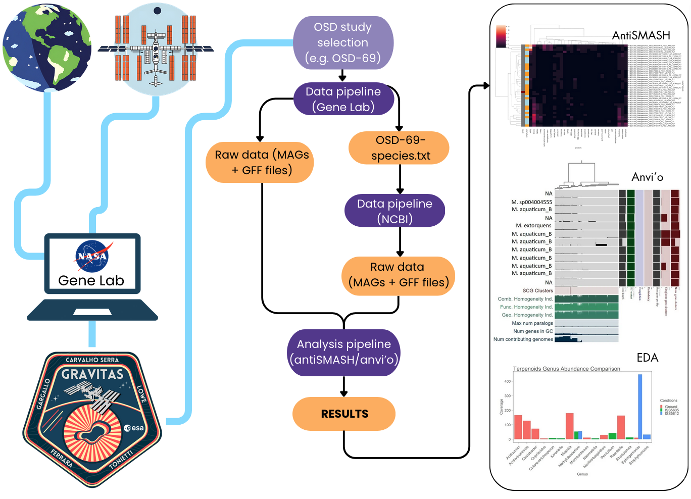
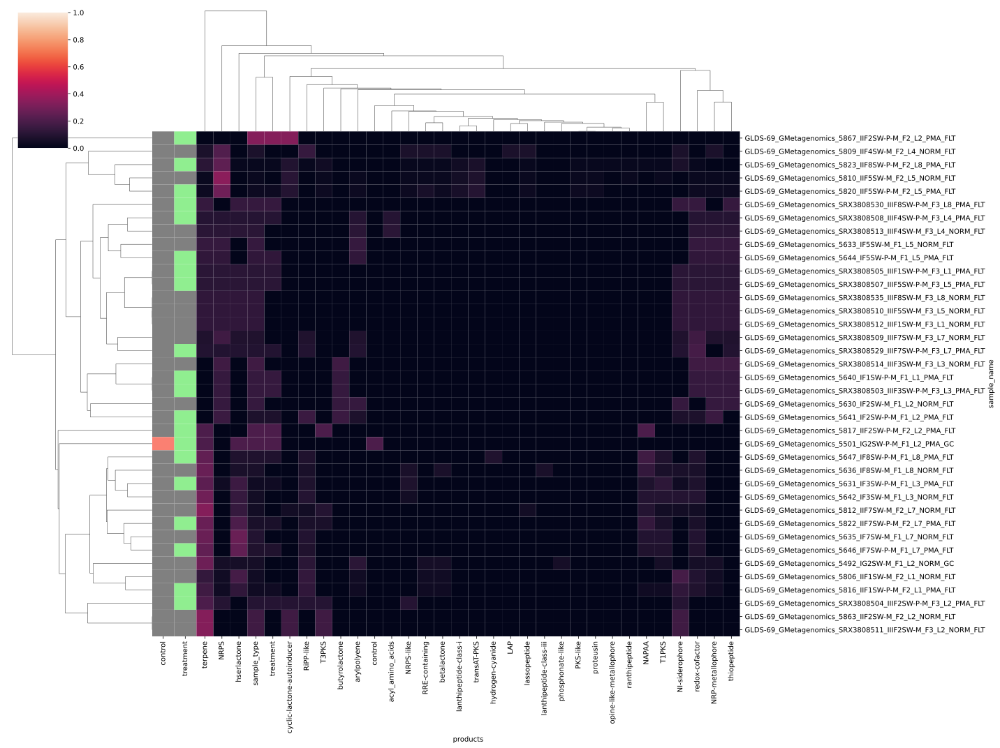
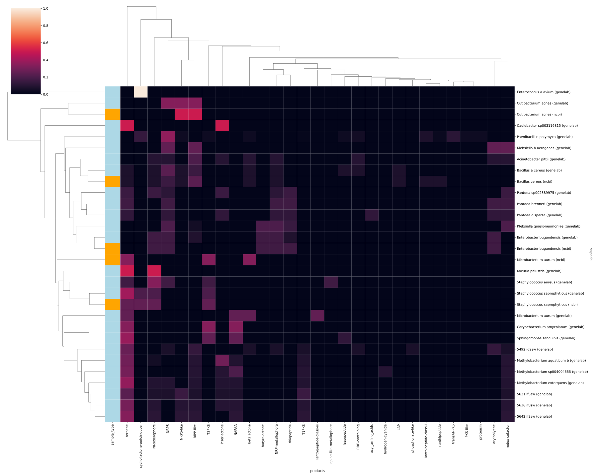

# Delving deeper into the metabolic potential of the ISS microbiome

**Team members:** Rita Carvalho Serra, Guillermo Climent Gargallo, Martina Ferrara, Jake Lowe, Luca Tonietti

**Team name:** GRAVITAS (Gravity and Relative Astrobiome Variation in Investigating Terrestrial and Astronomical Systems)


<br>


## 1. Introduction

The present pipeline allows to retrieve data related to an [OSDR study](https://osdr.nasa.gov/bio/repo/search?q=&data_source=cgene,alsda&data_type=study) and analyse the differential abundance of secondary metabolites, measured as the presence or absence of their corresponding biosynthetic gene clusters.

The pipeline follows these steps:

1) Retrieval of MAGs and GFF annotation files from OSDR for the selected study

2) Retrieval of species in the selected study

3) Retrieval of MAGs and GFF annotation files from NCBI for the selected species

4) Retrieval of biosynthetic gene clusters using antiSMASH

As an example, we have decided to use OSD-69 as the basis of our study, and will be used throughout the rest of the .README




After running both data pipelines, the directory tree will look like the following:

```bash
data/genelab
└── OSD-69
    ├── genelab
    │   ├── antismash
    │   └── raw
    └── ncbi
        ├── antismash
        └── raw
```


<br>


## 2. Installation

Please, follow the instructions provided in the [this file](environment/README.md).

Additionally, an [environment.yml](environment/environment.yml) is provided to easily install all required packages.


<br>


## 3. Automatically running the pipeline

For running the whole pipeline, use the [main-pipeline.sh](main-pipeline.sh) script, with the following flags:

* `-d` - the directory that will contain the data
* `-s` - the study ID
* `-t` - the number of threads/jobs

```bash
bash main-pipeline.sh -d ../data/genelab -s 69 -t 7
```


<br>


## 4. Manually running the pipeline


### 4.1. Data pipeline

The data pipeline comprises all steps for getting and preprocessing the data files (MAGs + GFF files) that will be given as input to the analysis pipeline.

#### 4.1.1. OSDR (GeneLab)

The [data-pipeline-genelab.sh](data-pipeline-genelab.sh) script retrieves and process the information from OSDR in the following steps:

1) Retrieves metadata and data files URLs for a given study ID (by calling [genelab-get-urls.py](utils/genelab-get-urls.py))
2) Downloads all data files using the given URLs
3) Reorganizes the files so that processing by the analysis pipeline is easier (by calling [genelab-reorganize.py](utils/genelab-reorganize.py))

```bash
bash data-pipeline-genelab.sh -d ../data/genelab -s 69 -t 7
```


#### 4.1.2. NCBI

The OSDR (GeneLab) data pipeline will return the `OSD-$study_id-species.txt}` file, containing all the species found for the given study ID.
Running the NCBI data pipeline will launch the [ncbi-genome-download](https://github.com/kblin/ncbi-genome-download) tool, which will query RefSeq to retrieve the MAGs and GFF files for each species.
The results will be stored in a subfolder for each species.

```bash
bash data-pipeline-ncbi.sh -d ../data/genelab -s 69 -t 7
```


### 4.2. Analysis pipeline

After running the data pipelines, the `raw` folders will contain the MAGs and GFF annotation files, which will be the input for the analysis pipeline.

#### 4.2.1. antiSMASH

For launching the antiSMASH pipeline, run the following command:

```bash
bash run-antismash.sh -d ../data/genelab/OSD-69/genelab/ -t 7
bash run-antismash.sh -d ../data/genelab/OSD-69/ncbi/ -t 7
```

The results folder will be named `antismash` and it will contain one folder per sample, which will in turn contain a folder for each MAG within the sample (actual raw results are returned by antiSMASH in JSON format). The results can be visualized by running the [antiSMASH.ipynb](../notebooks/antiSMASH.ipynb) notebook.


<br>


## 5. Preliminary results

Preliminary results for both the EDA (Exploratory Data Analysis) and antiSMASH can be found in the [figures](./figures/) folder.

For example, the following heatmap summarises the results of antiSMASH just for GeneLab, grouping by sample and normalizing values by sample:



Here, we can see in OSD-69 the difference between PMA (viable cells only) and NORM (full metagenome) MAGs, normalized for comparison. It can be immediately identified that there is a general increase in the usage of terpene- and NRP-related clusters. All MAGs shown here are retrieved from the OSDR.


The next heatmap displays the results of antiSMASH by grouping species and origin of samples (either GeneLab or NCBI), and normalizing by the same groups:



Usage of NCBI genomes enables the comparison between samples exposed to the ISS (OSDR) to ground controls of closely related organisms (NCBI), in lack of proper experimental controls (which seems to be widespread across OSDR studies). Raw coverage suggests an increased usage of terpenes and NRPs on the ISS, though normalized coverage gives clearer visualization.


## 6. Future work

1) Include more data (OSD-252 and OSD-224) spanning other locations of the ISS, since OSD-69 only harbors the US on-orbit segments: Node 1 (dining table), Node 2 (Crew Quarters), and Node 3 (Cupola, ARED and Waste and Hygiene Compartment); US Laboratory Module; and Permanent Multipurpose Module
2) Tag species according to their biosafety level (check whether we find species potentially harmful to astronauts with a biosafety level of 2 or higher) using the Bacterial and Fungal risk group database maintained by the [American Biological Safety Association](https://my.absa.org/Riskgroups) with the extended dataset
3) Continue metabolite characterization for other species, as we performed with terpenes for Methylobacterium sp. and Sphingomonas sp., searching for more adaptations to the ISS environment, with a focus on radiation adaptation
4) Automatization of the anvi’o pipeline


## 7. References

antiSMASH: 
1) Blin, K., et al. “antiSMASH 6.0: improving cluster detection and comparison capabilities” Nucleic Acids Research (2021)
2) Medema MH., et al. “antiSMASH: rapid identification, annotation and analysis of secondary metabolite biosynthesis gene clusters in bacterial and fungal genome sequences” Nucleic Acids Res (2011):W339-46

Anvi'o: 
3) Eren, A.M., et al. Community-led, integrated, reproducible multi-omics with anvi’o. Nat Microbiol (2021): 6, 3–6

GeneLab: 
4) Ray, Shayoni, et al. "GeneLab: Omics database for spaceflight experiments." Bioinformatics 35.10 (2019): 1753-1759.

NCBI: 
5) Schoch, Conrad L., et al. "NCBI Taxonomy: a comprehensive update on curation, resources and tools." Database 2020 (2020): baaa062.

Seaborn: 
6) Waskom, M. L., (2021). seaborn: statistical data visualization. Journal of Open Source Software, 6(60), 3021, https://doi.org/10.21105/joss.03021.

Plotly: 
7) Plotly Technologies Inc. Title: Collaborative data science Publisher: Plotly Technologies Inc. Place of publication: Montréal, QC Date of publication: 2015 URL: https://plot.ly
